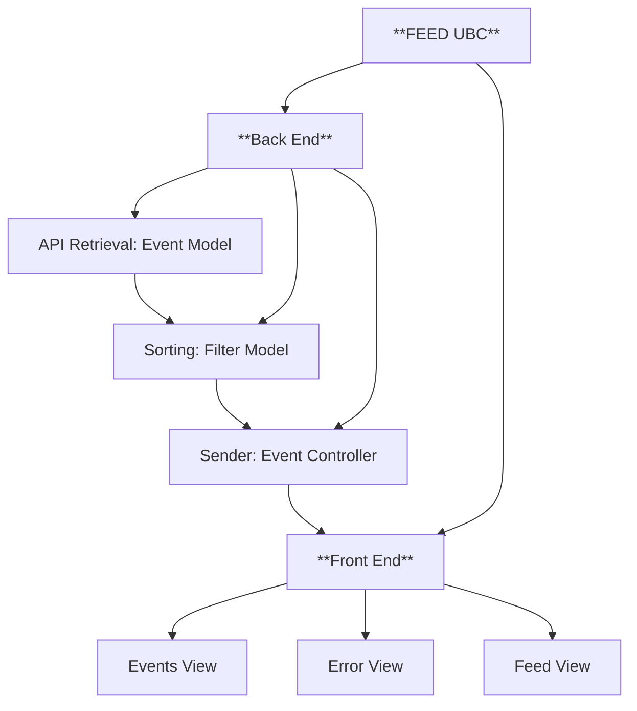

# Feed UBC: Project Specification and Roles

This document outlines the plan for developing the FEED UBC, breaking it into individual components with clear responsibilities. The project is divided into **Front End** and **Back End**, with sub-components assigned to specific team members.

## Assignments
| **Component**         | **Team Member**| Support                    | **Deadline**         |
|-----------------------|----------------|----------------------------|----------------------|
| API Retrieval         | Quinn          | Krish                      | 21th NOV             |
| Filter Model          | Krish          | Quinn                      | 23rd NOV
| Event Controller      | Ahmad          | Hamza, Sayyam              | 25th NOV
| Main Feed View        | Hamza          | Ahmad, Sayyam              | 26th NOV
| Events View           | Sayyam         | Ahmad, Hamza               | 26th NOV
| Error View            | Hamza, Sayyam  | Ahmad                      | 26th NOV
---

This way we can all have enough time for testing our components and complete the project before 29th of November.

---

## 1. API Retrieval:  Event Model
**Goal**: Retrieve event data from an API, and prepare it for further processing.

### Specifications:
1. **Data Retrieval**:
   - Retrieve raw data from newsletters and/or instagram posts.
   - Retrieve image or description to display on the Main Event View and Feed View.
2. **Data Validation**:
   - Validate correctness of the data.
3. **Storage**:
   - Store data in-memory in a way that it is easy to filter.

**Deliverables**:
- Functions: `EventData()` that Filter Model can access.
- Test to ensure correct data retrieval.

---

## 2. Sorting: Filter Model
**Goal**: Sort Event Model data to make it usable.

### Specifications:
1. **Data Parsing**:
   - Parse important data including date of events, food offered and organization.
   - If instagram is used perhaps include image 
2.  **Sorting Methods**:
   - Sort by Date, organization, food offered and location.
   - (User sorting could also be done here).
3. **Integration**:
   - Receive unsorted data from Event Model.
   - Return usable data to Event Controller.
   

**Deliverables**:
- Functions: `FilterdEvents()` that processes and returns structured event data: date,event_name, organization, food (and possibly description with main image etc).
- `DataTransformer()` to convert and organize raw unsorted data to usable data in a class that gives the Event Controller access to all information including dates,location, images etc. by EventName or EventId.
- Optional: If custom filter is used then add `CustomFilter()`.
- Test correctness of the filter.

---

## 3. Sender: Event Controller
**Goal**: Connecting the backend components to the Front End.

### Specifications:
1. **Controller Functions**:
   - Retreives data from Filter.
2. **Data Handling**:
   - Log and manage data from other filter model.
3. **Error Handling**
   - Manages errors from all connected components.
4. **Event Validation**
   - Ensures that at least the minimum requirement ie date and free food are present for each EventID to be valid.

**Deliverables**:
- Send validated Events to the Front End.
- Integration tests for the backend flow.
- Load tests.

---

## 4. Front End
**Goal**: Create a user interface for event display and interaction.

### Specifications:
1. **UI Framework**:
   - Ensure UI adapts across devices.
2. **Components**:
   - **Main Feed View**: List of all events.
   - **Event View**: Details of the each event.
   - **Error View**: Handle errors.
3. **Integration**:
   - Fetch data from the Event Controller.

**Deliverables**:
- Retrieve data from the Event Controller and display it.
- Front-end code with user-friendly and consistent interface.
- Responsive design and fits in well with backend.
- Event Search bar.
- Filters (Talk to the owner of "Sorting: Filter" about how to implement).
- Smooth transition from Feed View to Event View.
- All back end and front end Errors handled.

---

